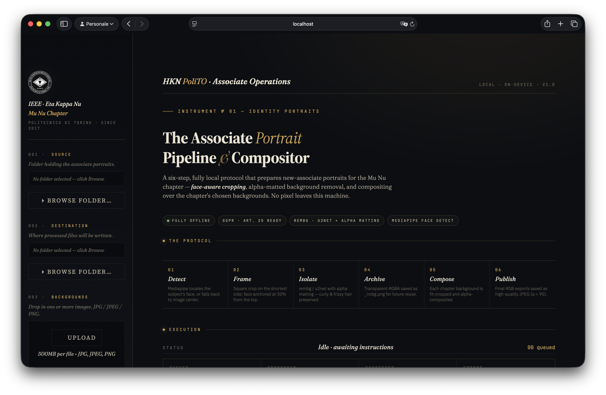

# HKN PoliTO — Associate Portrait Pipeline

<p align="center">
  <a href="https://github.com/MuNuChapterHKN/Eta-Kappa-Associate-Portrait-Pipeline/actions/workflows/ruff.yml"></a>
  <a href="https://github.com/MuNuChapterHKN/Eta-Kappa-Associate-Portrait-Pipeline/actions/workflows/smoke.yml"></a>
  <a href="https://github.com/MuNuChapterHKN/Eta-Kappa-Associate-Portrait-Pipeline/actions/workflows/codeql.yml"></a>
  <a href="https://github.com/MuNuChapterHKN/Eta-Kappa-Associate-Portrait-Pipeline/actions/workflows/gitleaks.yml"></a>
</p>

<p align="center">
  <a href="https://github.com/MuNuChapterHKN/Eta-Kappa-Associate-Portrait-Pipeline/releases/latest"></a>
  
  
  <a href="./LICENSE"></a>
</p>

<div align="center">
  
  <br/>
  <sub>The full pipeline UI — dark editorial theme, live console with per-image timing, CoreML acceleration on macOS.</sub>
</div>

<br/>

A local batch processor that takes raw associate photos, removes the background, and composites them onto chapter-standard backgrounds. Everything runs on your machine — no data leaves, no accounts, no cloud.

Built for the Mu Nu chapter of IEEE-HKN at Politecnico di Torino.

---

## What it does

When a new associate cohort comes in, someone has to process dozens of portrait photos: crop them consistently, strip the background, and drop each face onto the chapter background. This tool automates that in six deterministic steps:

1. **Detect** — Mediapipe locates the face in the image. OpenCV Haar cascade kicks in automatically if Mediapipe isn't available for the running Python version.
2. **Scale** — The raw image is Lanczos-downscaled so its longest edge fits `MAX_SIDE` — no cropping. Every subject pixel stays available for the canvas step below.
3. **Isolate** — rembg strips the background (ISNet or BiRefNet depending on quality setting) with alpha matting enabled. The matting trimap is intentionally wide so the solver has enough room to produce continuous alpha values on frizzy and curly hair instead of a binary cutout. **This step runs exactly once per input**; every output below reuses the same RGBA.
4. **Fit** — For each output, a transparent canvas is built at the target aspect ratio: face horizontally centered, face at 30 % from top *when possible*, and — crucially — the subject's **bottom flush with the canvas bottom**. Associates are framed as half-busts with crossed arms, so padding never goes below them; wider ARs get transparent side padding, taller ARs get transparent padding above the head. The subject is never cropped.
5. **Archive** — The 1:1 canvas (no background) is saved as `_nobg.png`. Same framing algorithm as the composites, so the archival version and the final 1:1 composite are identical above the background layer.
6. **Compose** — For each uploaded background, the background is cover-fit under the canvas and alpha-composited. Output takes on the background's aspect ratio, saved as JPEG at q=95, 4:4:4 chroma. The filename carries the AR tag: `photo_bg_studio_16x9.jpg`, `photo_bg_poster_2x3.jpg`.

---

## Quick start

```bash
git clone <repo>
cd HKN_BG_REMOVAL
./run.sh
```

The launcher script handles everything else: picks the best available Python (prefers 3.12, then 3.11, down to 3.10), creates a virtualenv, installs dependencies, and opens the Streamlit UI. Model weights (~175–970 MB depending on mode) download automatically on first run.

On subsequent runs it skips the install if `requirements.txt` hasn't changed (SHA-256 stamped).

---

## Using the UI

The sidebar is split into five labeled sections:

**001 · Source** — Click "Browse folder…" to pick the folder with raw portraits. On macOS the native Finder dialog opens via AppleScript. On other platforms a tkinter dialog runs in a subprocess (to avoid Streamlit's threading restrictions).

**002 · Destination** — Where processed files go. Created automatically if it doesn't exist.

**003 · Backgrounds** — Drop in one or more images (JPG or PNG). A preview chip shows a real thumbnail, resolution and file size for each. "Clear all" resets the uploader.

**004 · Quality** — Toggle between two modes:
- **Standard**: `isnet-general-use`, ~175 MB, fast. Uses CoreML on macOS for 3–6× acceleration.
- **High Quality**: `birefnet-portrait`, ~970 MB, slower. Runs on CPU (transformer ops cause CoreML graph compilation hangs, so it's hardcoded to CPU).

**005 · Execute** — "Begin processing" validates inputs, warms up models if needed (live progress), then runs the batch. The console shows per-image timing with a breakdown: matting time, composite time, and a running ETA.

---

## How the hair edges actually work

The design choice here is "purity first": the raw image goes into matting at full resolution, and whatever pymatting produces is what comes out. No supersampling, no pre-downscale, no detail injection or unsharp masking on top. Earlier iterations stacked all of those to chase crisper wisps, but on dense hair they started amplifying noise and rendering strands as over-sharpened edges.

**Alpha matting.** rembg's `alpha_matting=True` runs pymatting's closed-form solver on the uncertain trimap region. The thresholds are tuned deliberately loose (FG=250, BG=15, erode=30) so the uncertain band is wide. This forces the solver to compute real continuous alpha values on hair wisps instead of inheriting the model's binary mask.

**Full raw resolution.** The raw image is passed to rembg as-is — no pre-downscale, no supersample. At 24 MP inputs this means pymatting solves the alpha matte on tens of millions of pixels, which is slow; on a 2026-era Apple Silicon machine expect a few seconds of matting per image. In return: the trimap "uncertain" band is wide enough in native pixel space that the solver has real texture to work with on curly hair, instead of a bilinear-stretched version of a 1024²-internal mask.

**α-blended foreground colour + JPEG deblocking.** pymatting's colour estimator smooths the *decontaminated* RGB (the estimate of what the pixel would look like without the old background behind it). On dense opaque hair that smoothing shows up as flat "paint bucket" patches — wide regions of near-identical tone where the source photo had real texture. Fix: at α ≳ 0.99 the original pixel already is the pure foreground colour (background bleed ≤ 2 %), so use the original photo directly. Below α ≈ 0.92 keep the decontaminated version (real bleed needs removing there). Smoothstep blend in between.

One catch: dropping pymatting's smoothing exposes the original photo's JPEG 8×8 DCT blocks, which pymatting was inadvertently hiding. To fix that without losing strand texture we run a tight bilateral filter on the original RGB before the blend. Bilateral filter smooths pixels whose colours are similar within the spatial window, so JPEG quantisation noise (< ~15 units between neighbouring pixels in a flat block) gets averaged away, while real strand boundaries (large colour steps) stay sharp. Result: strand-level detail survives, block artefacts don't.

**Near-one α snap.** Values above 0.992 snap to exactly 1.0 so the opaque body of the subject stays perfectly opaque when composited.

---

## CoreML acceleration

On macOS, onnxruntime uses `CoreMLExecutionProvider` as the primary backend, routing inference through the Apple Neural Engine and Metal GPU. For convolutional models (u2net, isnet-general-use) this typically gives 3–6× speedup.

BiRefNet and other transformer-based models skip CoreML (`COREML_BLACKLIST` in pipeline.py). The CoreML graph compiler can hang for several minutes — or indefinitely — trying to convert complex attention ops. CPU is slower but at least it finishes.

The warm-up log shows which providers are active: `Metal / ANE` or `CPU only`.

---

## Output files

For each input image `photo.jpg` with a 16:9 `blue.png` and a 3:2 `white.jpg` background:

```
output/
  photo_nobg.png               # RGBA, 1:1 square archival, transparent background
  photo_bg_blue_16x9.jpg       # RGB, composited on blue, 16:9 aspect
  photo_bg_white_3x2.jpg       # RGB, composited on white, 3:2 aspect
```

The AR tag in the filename is the background's own aspect ratio, snapped to the nearest simple fraction (so `1920×1081` still collapses to `16x9`). The archival `_nobg.png` is always 1:1.

---

## Tuning

All the quality knobs are constants at the top of `pipeline.py`:

| Constant | Default | What it does |
|---|---|---|
| `MAX_SIDE` | 2048 | Output canvas resolution cap (px); matting itself runs at full raw resolution |
| `ALPHA_MATTING_FG` | 250 | Foreground threshold; higher = wider uncertain band |
| `ALPHA_MATTING_BG` | 15 | Background threshold; lower = wider uncertain band |
| `ALPHA_MATTING_ERODE` | 30 | Trimap erosion size (px at raw resolution) |
| `ALPHA_SNAP_HIGH` | 0.992 | Alpha values above this snap to 1.0 |
| `DECONTAM_BLEND_LO` | 0.92 | Below this α, use pymatting's decontaminated colour as-is |
| `DECONTAM_BLEND_HI` | 0.99 | Above this α, use the (bilateral-smoothed) original photo colour directly — eliminates the "paint bucket" smoothing on dense hair |
| `ORIG_RGB_BILATERAL_D` | 7 | Diameter (px) of the bilateral-filter kernel applied to the original RGB before the α-blend, to damp JPEG 8×8 compression blocks while preserving strand edges |
| `ORIG_RGB_BILATERAL_SIGMA_COLOR` | 18 | Colour-similarity threshold for the bilateral filter; only pixels closer than this get averaged together (so JPEG quantisation noise is smoothed, real strand boundaries stay sharp) |
| `ORIG_RGB_BILATERAL_SIGMA_SPACE` | 5 | Spatial falloff (px) of the bilateral filter |
| `SUBJECT_ALPHA_THRESHOLD` | 12 | Alpha (0–255) above which a pixel counts as part of the subject when computing the bounding box for canvas sizing |
| `FACE_TOP_RATIO` | 0.30 | Target face position from top (canvas may pad above when AR forces it, pushing the face lower — bottom stays anchored) |

---

## File structure

```
HKN_BG_REMOVAL/
├── app.py              # Streamlit UI
├── pipeline.py         # Image processing pipeline
├── run.sh              # Zero-setup launcher
├── requirements.txt    # Python dependencies
├── assets/
│   ├── theme.css       # Custom UI styles
│   ├── hkn_logo_white.svg
│   └── hkn_logo_society.png
└── .streamlit/
    └── config.toml     # Streamlit server config
```

Model weights go in `~/.u2net/` (managed by rembg). `run.sh` creates a `venv/` folder locally; it's gitignored.

---

## Requirements

Python 3.10–3.13. 3.14 is untested; some wheels may not be available yet.

Core dependencies: `streamlit`, `rembg`, `onnxruntime`, `mediapipe`, `opencv-python-headless`, `pillow`, `numpy`, `pymatting`, `scikit-image`.

No GPU required. CoreML acceleration is optional and kicks in automatically on macOS when available.

---

## Credits

**Author:** Matteo Sipione — [matteo@sipio.it](mailto:matteo@sipio.it)

**Organization:** HKN PoliTO — Mu Nu Chapter, IEEE-HKN, Politecnico di Torino

**Third-party libraries this tool is built on:**

| Library | What it does here |
|---|---|
| [rembg](https://github.com/danielgatis/rembg) | Background removal, alpha matting, model management |
| [pymatting](https://github.com/pymatting/pymatting) | Closed-form alpha matting solver |
| [Mediapipe](https://github.com/google-ai-edge/mediapipe) | Face detection |
| [onnxruntime](https://github.com/microsoft/onnxruntime) | ONNX model inference, CoreML backend on macOS |
| [OpenCV](https://github.com/opencv/opencv) | Image I/O, Haar cascade fallback, color conversion |
| [Pillow](https://github.com/python-pillow/Pillow) | Image compositing, resampling, format export |
| [NumPy](https://github.com/numpy/numpy) | Alpha channel math, detail injection |
| [Streamlit](https://github.com/streamlit/streamlit) | UI framework |
| [scikit-image](https://github.com/scikit-image/scikit-image) | Image utilities |

---

## License

Copyright 2026 Matteo Sipione  
Copyright 2026 HKN PoliTO — Mu Nu Chapter, IEEE-HKN, Politecnico di Torino

Licensed under the Apache License, Version 2.0. See [LICENSE](./LICENSE) for the full text.

---

*Mu Nu Chapter · IEEE-HKN · Politecnico di Torino*
